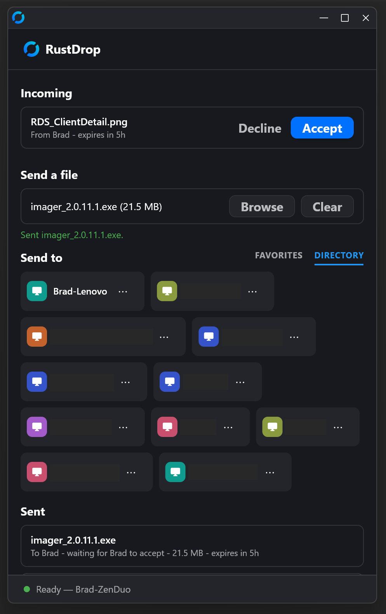
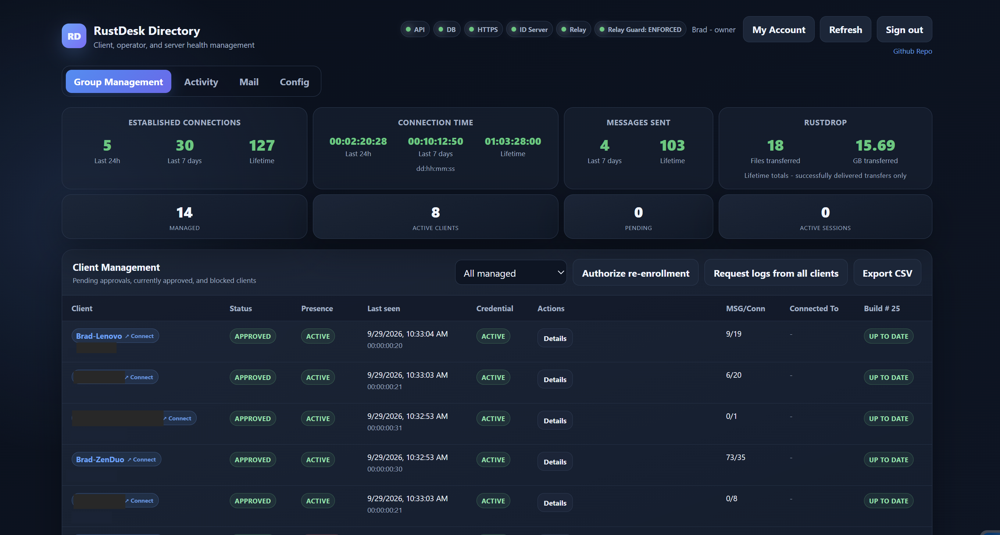

> **This is a fork of [rustdesk/rustdesk](https://github.com/rustdesk/rustdesk)**, the open-source
> RustDesk remote desktop client (AGPL-3.0). Full credit for the base client goes to the RustDesk
> team and its contributors.
>
> This fork ("RDC") adds a managed-fleet layer on top of the stock client, designed to pair with
> [rustdesk-managed-directory-api](https://github.com/MAGA-Brad/rustdesk-managed-directory-api)
> ("RDS"), a self-hosted Client directory and management server, and
> [rustdrop-storage](https://github.com/MAGA-Brad/rustdrop-storage) ("RD"), the storage service
> behind RustDrop file drops. Together they turn RustDesk from a remote-desktop tool you configure
> one machine at a time into a fleet you actually manage: Clients enroll themselves, a Client
> Manager approves them from a web UI, and signed updates roll out to everyone automatically —
> verified before they install, and never in the middle of a remote session. It also depends on a sanitized fork
> of [rustdesk/hbb_common](https://github.com/MAGA-Brad/hbb_common) as a submodule.

## What this fork adds

### Managed enrollment, not manual configuration
- A Client enrolls itself at install time — no per-machine server/relay/key configuration for end
  users to get wrong. The install form collects a friendly Client name, a contact email and an
  optional local access password (which requires 2FA), authenticates against a shared enrollment
  password, and the Client shows up in the directory as **pending**. Until a Client Manager approves
  it, it holds no directory credential — no fleet directory, relay-access lease, chat, RustDrop or
  updates.
- If a Client is blocked or denied, or its key changes while it's still pending, it isn't
  permanently orphaned — an **Owner-authorized re-enrollment** flow returns it to pending under its
  original directory record, revoking every old credential and relay lease before a replacement can
  be issued on re-approval. (Revoked is terminal.)
- Network settings are hidden from end users: no Server/Proxy/WebSocket fields to misconfigure,
  any WebSocket link is pinned to `wss://`, and all directory traffic is HTTPS-only to the one
  server compiled into the build.

### Signed, gated auto-updates
- Release manifests are Ed25519-signed on RDS at publish time. The client checks the signature against a public key
  compiled into the build, then checks the downloaded installer's size and SHA-256 against the
  signed manifest — a compromised or malicious update server can't push arbitrary code to a fleet.
- Updates install automatically, with no prompt. RDS tells the client's background service about a
  newly published build within seconds (see change-driven sync below); the service also checks 30
  seconds after it starts and every 30 minutes as a backstop, and installs a new build as soon as
  it's verified. The one gate: it never installs while a remote session is active. For a build RDS
  announced it checks every 30 seconds and installs once the session ends; otherwise the next
  scheduled check tries again in 30 minutes.
- While a verified update is waiting, the client shows **"Update Available"**, and **Update Now**
  applies it immediately (same no-active-session rule).
- The install is launched by the managed client's own background service, so no UAC prompt is
  needed on the end user's machine — and only an installer that passed the signature and hash
  checks above is ever launched that way.
- One installer for every Windows PC: it carries both the x64 and the ARM64 build and installs
  the one native to the machine it runs on. RDS publishes a signed manifest per architecture.
- [RDC for Android](#rdc-for-android) follows its own signed APK channel.

### Built for a real fleet, not a demo
- Multi-process aware: the GUI, the background Windows service, and the per-session connection
  process each run independently — enrollment status, pending-update state, and update triggers
  are relayed between them over an authenticated local IPC channel rather than assumed to be
  shared state.
- CGNAT-friendly: RDS's relay guard leaves the registration and relay-data ports to RustDesk's own
  protocol-level authentication rather than the relay-lease source-IP allowlist, because carrier NAT
  pools (a mobile hotspot, for example) can give the lease call and the registration socket
  different public IPs.
- **Change-driven sync.** The background service, the session process and the RustDrop window each
  keep a wait open on RDS and act within seconds when the directory, a drop, the latest signed
  build, a log request or the Client's own status changes, instead of polling on a timer. The
  directory is downloaded again only when it changed (with a 5-minute backstop), and RDS sets the
  heartbeat interval.
- **Filtered networks.** When the relay-lease host or the RustDrop transfer host is unreachable,
  those calls retry through the directory host.
- **Port 443 fallback for hbbs and hbbr.** On networks that only let web traffic out, or that block
  the server's address altogether, a managed Client reaches hbbs and hbbr over a WebSocket on 443
  through a separate, CDN-fronted fallback host (`RUSTDESK_MANAGED_WS_FALLBACK_HOST`). TCP gets a
  3-second head start; if it hasn't connected (and finished hbbs's key exchange) by then, the
  WebSocket races it and the first to finish wins. After the WebSocket wins, it leads for the next
  10 minutes. Each path also starts a fresh attempt every few seconds while earlier ones hang,
  because some filtering firewalls stall TLS handshakes at random.
- **Online status on the encrypted connection.** A managed Client asks hbbs which peers are online
  over a key-exchanged connection to hbbs's main port (TCP or the 443 fallback) instead of the
  separate NAT-test port, and reuses that connection for queries less than 20 seconds apart, so a
  refreshing peer list doesn't open a new one each time.
- **Always the Windows session in use.** A remote connection lands on whichever Windows session is
  actually in use — its desktop, its lock screen if it's locked, or the sign-in screen if nobody is
  signed in. There is no Console/RDP session picker, and the client's service follows the active
  session on its own as people sign in, lock, or connect and disconnect over RDP.
- **Connection telemetry for tuning, not surveillance.** For each remote-desktop or file-transfer
  session it starts, a managed Client (Windows, or RDC for Android) reports the peer's RustDesk ID, the session type, its
  route (relay, WebRTC, or a direct UDP, TCP or IPv6 connection), connect time, the relay-fallback
  delay in effect, duration and
  average/maximum round-trip delay to RDS, so relay-vs-direct decisions can be made from real
  numbers. No screen,
  input or file content is ever reported.
- A local-input-priority guard (Windows): the moment the person at the machine moves the mouse,
  remote mouse and keyboard input is dropped for a short window (1–5 s, adjustable) — and remote
  block-input/privacy mode are disabled, so nobody connected remotely can lock the local user out.
- Windows installer/service hardening and protected credential storage: the enrollment credential
  is DPAPI-encrypted in a file whose protected ACL admits only SYSTEM and Administrators — not
  sitting in a plaintext config file.

### Locked down by default
- Password and unattended access always require TOTP 2FA on a managed Client.
- Camera, terminal and tunneling sessions are refused; audio, remote printer, session recording,
  block-input and privacy mode are forced off; trusted devices, LAN discovery and the third-party
  notification bot are disabled.
- **Settings the fleet decides are pinned, not just hidden.** Connection settings (hole punching,
  WebRTC and the relay-fallback delay), rendering and codec choices, how incoming sessions are
  accepted (always by password or by click), keep-awake and wallpaper behaviour, local-input
  priority, language, theme, the tab and toolbar layout, and auto-disconnect are fixed values in a
  managed build. Their controls are gone from Settings, and no UI, command line, local IPC call or
  stale config file can change them. Users keep the Permissions card, 2FA, their permanent
  password, the contact email, clipboard sync between sessions and the end-of-session note.
- **AV1 first.** With the codec on Auto, a managed Client encodes AV1 when the machine has at least
  4 CPU threads (AV1 is encoded in software) and the viewer can decode it; otherwise it keeps
  upstream's order (hardware H.265 or H.264 where available). A machine with 4 GB of memory or less
  still uses VP8, as upstream does.
- **Quick reconnects don't ask twice (Windows).** When a session drops and comes straight back (a
  network blip, a stalled stream, the service restarting), the same controller rejoining the same
  session within about 90 seconds isn't asked for the password, 2FA or a click again. This only
  applies to a controller that proved itself with an RDS device certificate, and ending the session
  on purpose cancels it (see [On the managed Client itself](#on-the-managed-client-itself)).
- **Session features a managed Client doesn't have:** in-session text chat (managed chat replaces
  it), audio in either direction and voice calls, screenshots of the remote screen, session
  recording, block-input, privacy mode, camera and terminal sessions, and the Windows session
  picker. The controller doesn't offer them, and the controlled side refuses in-session chat,
  audio and voice calls, block-input, privacy mode, camera and terminal sessions and the session
  picker even if a modified controller asks. Recording and screenshots happen on the controlling
  machine, so the controlled side can only withhold the permission and refuse its own screenshot
  service; it can't stop a modified controller from capturing the video it receives. Both cursors
  are on when a session starts and the controlled side keeps sending its cursor; the controller
  can still hide cursors in its own view.
- **No remote printer.** The installer doesn't offer the printer driver, an update removes one that
  was installed earlier, and the print-job service never starts.
- A SYSTEM-level watchdog keeps the client's service running, and end users can't stop it from the
  UI.
- Session start and end are reported to RDS, which drives the dashboard's "In session" and
  "Connected To" views.

### Direct connections over WebRTC, with the relay as the fallback
- **RDS decides.** WebRTC is off, on for listed test Clients, or on for everyone, set on the RDS
  Config page and delivered with the directory. When it's on, a connection races a WebRTC direct
  path against the relay and holds a finished relay back for the relay-fallback delay so the direct
  path can win; the relay remains the fallback.
- **Your own STUN server only.** Build with `RUSTDESK_MANAGED_ICE_SERVERS` listing your STUN
  server (at least one `stun:` URL) and a managed Client uses only that list; if the variable is
  unset or lists only TURN servers, upstream's public STUN defaults are added. The public IPv6
  address probe, which uses third-party STUN servers, is disabled in managed builds (IPv6 hole
  punching is off).
- **Sealed signaling.** The offer, answer and ICE candidates are encrypted between the two Clients
  (see [Security model](#security-model)).

### RDC for Android
A controller-only managed app for Android phones and tablets (arm64), built from this same tree.
It connects out to the fleet's Clients; nothing connects in to it.
- **Its own app.** Build the APK with the managed variables plus `RDC_ANDROID_APPLICATION_ID`,
  `RDC_ANDROID_APP_LABEL` and `RDC_ANDROID_DEEP_LINK_SCHEME`, so it installs beside stock RustDesk.
  The managed build pins outgoing-only mode. Release builds made with `RDC_ANDROID_APPLICATION_ID`
  set also get a manifest overlay that drops the start-on-boot receiver, the accessibility input
  service, the floating window and the microphone permission, excludes app data from backup and
  device-to-device transfer, and declares what self-updates need.
- **Same enrollment.** First launch asks for the enrollment password, a friendly name and a contact
  email; the device shows up in RDS as **pending**. Once it's approved, its first heartbeat marks it
  as Android (a badge, and no Connect link). There is no local access password, since nothing
  connects in.
- **Same proofs as Windows, signed in the app.** Android runs it as one process, so the app signs for
  its own ID instead of asking a separate service: the device certificate on every login, the
  device passport on its rendezvous connection, sealed RDS calls, WebRTC with sealed signaling, the
  edge client certificate, public-roots-only TLS to RDS, the IPv4 relay-lease fallback,
  change-driven sync and connection reports.
- **Secrets in the Android Keystore.** The directory credential, the identity key and the
  edge-certificate key are encrypted with a non-exportable AES-GCM key held by the Android
  Keystore. The identity key's protection is reported to the CA as `keystore`.
- **Log uploads and a device report.** The app writes its own log file (mirrored to logcat) and
  uploads it like Windows Clients do, with an Android report: patch level, screen lock, storage
  encryption, whether the Keystore key is in secure hardware (TEE) or software, verified boot and
  bootloader lock, developer options and USB/wireless debugging, who installed the app, and the
  network type, VPN and Private DNS. RDS shows it on the Client's Security panel.
- **Signed self-updates.** The same Ed25519 manifest and size/SHA-256 checks as the Windows client,
  on the update architecture `android-aarch64`, where RDS serves only APKs. Android release numbers
  are the managed build × 100 + a revision (`RDC_ANDROID_VERSION_CODE`), so the app can ship a fix
  without a new Windows build. An update is held while a remote session is open (re-checked every
  few seconds). After a manual install, Android asks once (allow installs from RDC, then
  **Update**); on Android 11 and older it asks every time. From then on RDC is the app's installer
  of record and Android 12+ normally updates it without asking: the verified APK is written to an
  install session ahead of time and committed when the app leaves the screen.
- **Limits.** No managed chat or RustDrop. Android has no always-on service for it: the background
  work (heartbeat, certificates, sync, updates) runs while the app process is alive, and some
  vendors freeze apps soon after they leave the screen.

### Pairs with RDS and RD
This client is one part of a set of three:
- **RDS** — the self-hosted management server, in
  [rustdesk-managed-directory-api](https://github.com/MAGA-Brad/rustdesk-managed-directory-api). It
  runs alongside hbbs/hbbr (RustDesk's own rendezvous/relay servers) rather than proxying them.
  RustDesk's remote-session protocol is unchanged apart from one optional login field that carries
  the device-certificate proof, which stock clients ignore. What it provides:
  - **Enrollment and lifecycle** — password-gated self-enrollment, approval by a Client Manager,
    block/revoke/re-enroll flows, and friendly-name reservation.
  - **Client Manager accounts** — owner/manager/viewer roles, TOTP at every sign-in, and an
    append-only audit log.
  - **A device-certificate authority** — short-lived certificates that let managed Clients prove
    they're approved on every connection (see [Security model](#security-model)).
  - **Device passports**, signed by a separate CA VM that pulls its jobs from RDS (the signer is in
    the same repository), plus the switch for hbbs's passport check.
  - **Signed update manifests** per architecture, and per-Client build/update tracking.
  - **Relay-access leases** synced into a firewall allowlist.
  - **An admin dashboard** — Group Management, Client details (hardware including dedicated and
    integrated GPUs, build, who's in session with whom), activity and audit history, Server Health
    (services, host vitals, storage and drive wear, sensors and UPS), and Mail and Config tabs. The
    Config tab's Remote Connections group sets the certificate mode, certificate lifetime and
    renewal, the relay-fallback delay, the rendezvous-encryption mode, the WebRTC switch and the
    passport check, and shows connection stats by route and hbbs's passport counts. Each Client's
    page has a Security section built from its device report, and Client Management has fleet
    filters such as "clock off by more than 1 minute".
  - **Sealed transport** for managed-client API calls, with a Networks view where the owner decides
    which TLS-intercepting networks may be served.
  - **Edge client certificates** for the Clients, issued through Cloudflare's managed client CA.
  - **State-change alerts** by push to the companion mobile app and by email.
  - **Remote debug-log requests**, plus hourly log uploads with chat content scrubbed.
  - **The managed-chat relay and the RustDrop broker.**
  - **Ops automation** — daily backups with a weekly restore test, the relay-guard sync, and a
    health collector.
- **RD** — [rustdrop-storage](https://github.com/MAGA-Brad/rustdrop-storage), the blob store that
  holds RustDrop's encrypted files. Clients never talk to it directly: RDS authorizes every
  transfer and streams the ciphertext to and from it.

### Managed chat
- A lightweight text channel to a specific managed Client, separate from RustDesk's own in-session
  chat — works whether or not a remote-control session is active, relayed through RDS rather than
  the relay/rendezvous server. Messages wait on RDS (up to 30 days) for a Client that's offline.
  Useful for a quick "starting your remote session now" without a separate side channel.
- If the app isn't running when a message arrives, the client's service starts it in the
  signed-in user's session and brings the chat window to the front.

### RustDrop — managed, end-to-end encrypted file drops
> **In active development.** Treat as experimental — not yet feature-flagged off, and some rough
> edges are still being worked through.
- An end-to-end encrypted way to send a file between two managed Clients, resumable across
  network drops and pauses, replacing the legacy file-transfer buttons in the managed client UI.
  Transfers go through RDS, which stores the
  ciphertext on RD (rustdrop-storage), rather than through the relay/rendezvous server — so no
  remote-control session needs to be active on either end.
- RustDrop is a window of the client itself. There's no signaling between the two machines
  directly; RDS brokers the handoff and neither side ever gets raw file-system access to the other.
  When a file arrives, the RustDrop window opens (or comes to the front) in the signed-in user's
  session on the receiving machine.
- Content is encrypted client-side (X25519 + XChaCha20-Poly1305) with a keypair each Client
  generates locally — only the public half is registered with RDS. RDS relays ciphertext and never
  holds a private key (it does see file names and sizes, and is trusted to hand out the right
  public keys).
- When the recipient supports it, compressible files (1 MiB and up, whose start shrinks by more
  than 10%) are compressed with zstd chunk by chunk before they're encrypted, so transfers get
  smaller while RDS and the store still see only ciphertext.

### Support and diagnostics, built in
- An **About** screen shows the build number, build date, RustDesk ID and key fingerprint — the ID
  and build number are what a Client Manager sees for that Client in RDS, so matching a support call
  to a dashboard entry doesn't require guesswork.
- **Remote debug-log requests**: the primary Owner account can request a Client's debug log from
  RDS — one Client or every approved Client at once — delivered on its next check-in, without
  needing a remote session into the machine first just to go looking for logs. Clients also upload their new log lines hourly on their own
  (only what's new since the last upload), catching up as soon as they're back online.
- The client self-reports its managed build number on every heartbeat, so RDS's Client Management
  view always shows real per-Client build/update status instead of an assumed one.
- **A security report with each log upload** (Windows): TPM presence and version, Secure Boot and
  UEFI, BitLocker, the Windows version and patch level, Defender and firewall status (including the
  RustDesk firewall rules), the clock's sync source and its offset measured against the configured
  NTP server,
  whether connections currently go over TCP or the 443 fallback, how the identity key is protected,
  passport and certificate expiry, and whether the machine is a VM. RDC for Android sends its own
  report (see [RDC for Android](#rdc-for-android)).

## Security model

The aim: only machines a Client Manager has approved can take part, every piece of code they
run is verified, and every layer assumes the one in front of it can fail.

### Every Client is approved — and proves it on every connection
- **Enrollment is gated and reviewed.** A new install authenticates with an owner-managed
  enrollment secret (optional expiry and use limits) and arrives as **pending**. It gets no device
  credential, directory, relay lease, chat, RustDrop or updates until a Client Manager approves it.
- **The device credential stays on the machine.** It's held by the client's background service,
  DPAPI-encrypted in a file whose ACL admits only SYSTEM and Administrators.
- **Device certificates.** RDS runs a small Ed25519 certificate authority:
  - **Issuing.** Each approved Client's background service asks RDS for a certificate binding its
    RustDesk ID to its device public key. RDS issues certificates only to approved Clients.
  - **Lifetime.** 96 hours by default, renewed once it's 24 hours old; both are adjustable on the
    RDS Config page. A machine that's been switched off for a few days still has a valid
    certificate when it comes back.
  - **Keys.** The CA's private key lives only on the server. Its public key is compiled into every
    client build (`RUSTDESK_MANAGED_PEER_CA_PUBKEY`).
- **Peer proof on every login.** When a managed Client (Windows, or RDC for Android as the
  controller) connects to another, it attaches
  its certificate
  plus a signature made with its RustDesk device key. That signature covers the login challenge the
  other side just issued, both RustDesk IDs and the session ID, so it can't be replayed or reused
  for another session.
  - The signature is made inside the privileged RustDesk server process, which refuses to sign for
    any ID but its own. RDC for Android, a single process, signs for its own ID in the app.
  - The receiving Client checks the certificate (CA signature, validity window, matching ID) and
    the proof.
  - It then cross-checks the directory RDS gave it. If the caller is listed, the certificate's key
    must be that Client's current key.
  - While that directory copy is fresh (under 10 minutes old), an unlisted caller is treated as not
    approved. With an older copy, the certificate alone decides. So a blocked or revoked Client is
    refused within about 10 minutes, or at the latest when its certificate expires.
- **One switch: off, log, or enforce.** In **log** mode a failed check is recorded and allowed,
  which lets a fleet roll forward. In **enforce** mode the connection is refused with "This device
  is not approved in RDS". It's set from the RDS Config page and pushed to every Client with the
  directory.

### Device passports: one identity, proven on every rendezvous connection
- **The device's own identity key.** On Windows, a managed Client's background service creates an
  Ed25519 identity key of its own, separate from the RustDesk key, and keeps it DPAPI-protected
  (machine scope) in a file only SYSTEM and Administrators can read. It moves
  its record at the CA from the RustDesk key to this key once, with a key update signed by both.
  RDC for Android does the same with its identity key encrypted by an Android Keystore key.
- **A short-lived passport from a separate CA.** The passport binds the RustDesk ID, the RDS device
  ID and the identity key. It's signed by a CA that runs on its own VM: RDS only queues jobs, and
  the CA VM pulls them, applies its own rules (renewals must be signed by the key on file,
  revocations always win) and signs. Passports last 1 day by default (RDS Config, 1 to 7 days); the
  Client renews at half-life with a request signed by its identity key. The CA's root public key is
  compiled into the build (`RUSTDESK_MANAGED_PASSPORT_ROOTS`) and given to hbbs from its own host
  configuration, never from the RDS database.
- **Proven on the connection, not carried as a bearer token.** When hbbs offers it in the signed
  key exchange, the Client sends its passport plus a signature made with its identity key over
  that connection's key exchange (hbbs's signing key, both ephemeral keys and the protocol
  version). A recorded proof is useless on any other connection. The privileged service signs; the
  GUI process asks it over local IPC and can only get this kind of connection proof. (RDC for
  Android signs in the app.)
- **Two boxes must agree.** hbbs accepts a passport only if it chains to a root it was started with
  *and* its identity key matches the fingerprint RDS lists for that ID, synced every 60 seconds.
  RDS decides that key itself: it checks a device's signed key update when the device sends it,
  and refuses any CA result whose key, or the key inside the passport, differs. So the CA alone
  can't make or re-key a device, and RDS can't sign a passport; every new key RDS asks the CA to
  sign is mailed to the owner.
- **One switch: off, log, test, or enforce.** Set on the RDS Config page. **Log** counts proven and
  unproven requests; **test** refuses unproven requests only where a listed test device is involved
  (on either end); **enforce** refuses every connection request, reply and online-status query the
  connection can't back. RDS won't allow enforce while any approved Client seen in the last 30
  days reports a build older than 34. A recently expired passport is still accepted for a grace
  period (7 days by default), but only while hbbs has a current approved list.
- **Not covered yet:** registration with hbbs (it still runs over UDP), the opening relay request to
  hbbr, and the NAT test's second port.

### Code you didn't sign never runs
- **Signed manifests.** Update manifests are Ed25519-signed on RDS. Each one pins the installer's
  exact size and SHA-256.
- **Verified before launch.** The client verifies the manifest against a public key compiled into
  the build, then checks the downloaded installer against the manifest. Only then does its service
  launch the installer.
- **What the signing key protects against.** A compromised CDN, proxy or download path can
  withhold updates but can't push code to the fleet. The signing key is the trust anchor: whoever
  holds it can publish. In the reference deployment that means root on the RDS host, so keep the
  key out of anything a network-facing service can read.

### Encrypted in transit, with honest limits
- **Remote sessions** use RustDesk's own end-to-end session encryption, so the relay forwards only
  ciphertext. If encryption can't be established, stock RustDesk warns the person connecting and
  lets them decline; a managed Client on the receiving end refuses the connection outright.
- **Rendezvous traffic is encrypted from the first request.** A managed Client's connections to
  hbbs, over TCP or the 443 WebSocket fallback, start with hbbs's signed key exchange: connection
  and relay requests, online-status queries, health checks, the NAT test, and WebRTC answers and
  candidates. On the WebSocket the exchange runs inside it, so the CDN in front of the fallback
  host can't read or forge it either. The client refuses a server that can't sign with the key
  compiled into the build, so a managed build needs hbbs from
  [rustdesk-managed-relay](https://github.com/MAGA-Brad/rustdesk-managed-relay) with encryption at
  **optional** or **required**; against stock hbbs, or with encryption off, it can't connect (RDS
  won't let encryption be switched off while any approved Client reports build 30 or newer). Not
  covered yet: the UDP registration channel, the second leg of the NAT test (hbbs's port 21115),
  the opening relay request to hbbr, and an administrator's command-line ID change. Session
  content through the relay is end-to-end encrypted regardless.
- **WebRTC signaling is sealed end to end.** For each attempt the controlling Client makes a fresh
  key, seals it to the target's device key as listed in its RDS directory, and signs the offer with
  its own device key. The answer and every ICE candidate are encrypted with that key, with the
  direction inside so a candidate can't be reflected back. hbbs routes them but can't read them
  (they hold each machine's network addresses), and the target answers only offers signed by a
  Client its directory lists as approved. The WebRTC channel itself is DTLS, and the controller
  checks that the target's DTLS fingerprint is signed with the target's RustDesk identity.
- **Directory traffic is HTTPS-only.** It goes to the single server compiled into the build, and
  any WebSocket link is pinned to `wss://`. RDS sits behind a TLS reverse proxy with strict SNI/Host
  matching, and gets a separate virtual host for each audience: rendezvous, admin, managed-client
  API and file transfer.
- **The proxy decides which client address RDS sees.** When RDS is fronted by a CDN, it trusts a
  forwarded client address only from that CDN's published address ranges. Per-client rate limits
  and the audit trail therefore see real client addresses instead of the CDN's.
- **Sealed API calls, even through TLS inspection.** On Windows and Android, managed-client API calls to RDS
  are also encrypted end to end to an X25519 key compiled into the build
  (`RUSTDESK_MANAGED_SEAL_PUBKEY`), with a fresh key per call. Whatever terminates TLS on the way
  (a CDN, a school or corporate HTTPS filter, local filtering software) sees only ciphertext and
  can't read, alter or replay a sealed call, or forge its answer.
  - **On an intercepting network** only sealed calls continue, over a connection that tolerates the
    interceptor's certificate because the envelope protects them; the client doesn't trust that
    certificate for anything else. RDS decides per network and per Client whether to serve them
    (see the RDS README).
  - **Never downgraded.** A call that can be sealed is never sent without the envelope. If the
    sealed endpoint refuses it (404/405, 400 or 503), the call fails like any other failed call
    (background sync tries again on its next cycle), so nothing that can answer for the RDS host,
    the CDN included, can push it into plaintext. RDS opens every envelope as long as it holds the
    key the Client was built with (the current key, or the one previous key kept through a
    rotation) and the Client's clock is within 10 minutes; policy refusals come back inside the
    envelope.
  - **Limits.** Very large or streamed bodies aren't sealed. File transfers, installer downloads,
    the chat WebSocket and the relay lease use verified TLS, except the relay lease's fallback
    through the directory host, which is sealed.
- **Edge client certificates.** Each approved Client holds a client certificate from Cloudflare's
  managed CA, requested with a key generated on the device, and presents it to the RDS edge.
  Requiring it at the edge is a separate switch.
- **RustDrop files are end-to-end encrypted** with X25519 + XChaCha20-Poly1305. RDS sees file names
  and sizes, never content.
- **Managed chat is protected in transit but not end-to-end encrypted.** RDS holds each message only
  until it's delivered, for at most 30 days.

### Relay access is leased (where it can be)
- **Short-lived leases.** Approved Clients get relay-access leases that last 10 minutes and renew
  automatically. A Relay Guard daemon syncs them into an nftables allowlist every few seconds.
- **What the leases gate.** They gate the NAT-test port (TCP 21115) and the direct WebSocket ports.
  The rendezvous port (21116) and relay port (21117) stay open by design, because carrier-grade
  NAT can give a Client different public addresses for the lease call and the connection. The
  approved-device boundary on those ports is the device certificate, not the firewall.
- **The reference deployment runs a hardened relay build:**
  - message-size caps before a peer authenticates or pairs;
  - WebSocket listeners bound to loopback behind the TLS proxy;
  - an optional approved-device gate;
  - the signed key exchange on rendezvous connections, TCP and WebSocket (off, optional or
    required, set from RDS);
  - online status answered on those connections, and only to approved Clients;
  - the device-passport check (off, log, test or enforce, set from RDS);
  - WebRTC signaling, switched from RDS (off, test Clients, on).

  The relay patches are published in [rustdesk-managed-relay](https://github.com/MAGA-Brad/rustdesk-managed-relay).

### The people who manage the fleet
- **Accounts.** Client Manager accounts have owner, manager or viewer roles. Dashboard and API
  actions are checked against the role on the server. Passwords are bcrypt-hashed (cost 12).
- **Sign-in.** TOTP is required at every sign-in. An access reset that clears the authenticator
  forces a new one to be enrolled through the one-time reset link before any sign-in. Five failed
  attempts lock the account for 15 minutes.
- **Sessions.** Web sessions end after 8 hours idle, enforced server-side. The mobile app keeps its
  own long-lived session.
- **Records.** Every enrollment, status change, sign-in and account action goes into an append-only
  audit log; database triggers block edits and deletes.
- **Credentials and revocation.** The web dashboard never hands out a Client's credential, and
  revoked is terminal.

### On the managed Client itself
- **2FA everywhere.** TOTP 2FA is required for password and unattended access. Rejected logins are
  logged: wrong password, wrong 2FA code, and lockouts.
- **Reconnect passes, narrowly (Windows).** After a login from a controller whose RDS device
  certificate checked out, the controlled Client keeps a pass for that controller ID and session
  ID: valid for 2 minutes from its last renewal, renewed every 30 seconds while the session lasts.
  A login with the same IDs from a certificate-verified controller inside that window skips the
  password, 2FA and the accept click; anything else goes through the normal checks. Passes are
  stored as hashes in a file only SYSTEM and Administrators can read, and are cancelled when the
  session ends on purpose: either side disconnecting, the connection manager or web console
  closing it, the service being stopped from RustDesk's settings, switching sides, or a
  session-scope violation. A Windows service restart keeps them.
- **Local IPC.** The local control channel accepts only the same RustDesk executable, running in
  the same Windows session, as SYSTEM, or as an elevated administrator (upstream RustDesk's rule).
- **The person at the machine stays in control:**
  - local input takes priority over remote input;
  - block-input and privacy mode are disabled;
  - camera, terminal, tunneling, audio, printer, screenshot, in-session chat and session-recording
    features are off;
  - the settings the fleet decides are pinned;
  - a SYSTEM watchdog keeps the service running.

### What RDS can see
- **Device information:**
  - directory metadata, status and build numbers;
  - hardware details including GPUs;
  - security posture from the device report (TPM, Secure Boot, BitLocker, patch level, Defender
    and firewall, clock offset, connection path) and each Client's identity-key fingerprint and
    passport;
  - who is in session with whom;
  - per-connection timing (peer, session type, route, connect time, round-trip delay);
  - client IP addresses (audit log, enrollment, relay leases), contact emails and hostnames;
  - for a Client behind TLS interception, the network's address and owner and the intercepting
    certificate's issuer and subject.
- **Logs.** Uploaded debug logs, with chat content scrubbed server-side, kept for up to a year.
- **Content.** Undelivered chat messages, and RustDrop file names and sizes. It never sees
  screens, input or RustDrop file contents. That last guarantee assumes RDS hands out the right
  RustDrop public keys.

## Building a managed client

A managed client is the normal RustDesk build (see the upstream instructions below) with your
deployment's values compiled in through environment variables at build time. A build without
them is a stock, unmanaged client. None of the real values are in this repository; supply your
own.

| Variable | Purpose |
|---|---|
| `RUSTDESK_MANAGED_DIRECTORY_BASE` | HTTPS base URL of your RDS managed-client API (turns managed mode on) |
| `RUSTDESK_MANAGED_RELAY_LEASE_BASE` | Optional separate base URL for relay-access leases (defaults to the directory URL) |
| `RUSTDESK_MANAGED_SERVER` / `RUSTDESK_MANAGED_KEY` | Your rendezvous server address and its public key |
| `RUSTDESK_UPDATE_SIGNING_PUBLIC_KEY` | Ed25519 public key that update manifests must be signed with |
| `RUSTDESK_MANAGED_PEER_CA_PUBKEY` | Ed25519 public key of RDS's device-certificate authority |
| `RUSTDESK_MANAGED_SEAL_PUBKEY` | X25519 public key of RDS's sealed transport (API calls are encrypted to it) |
| `RUSTDESK_MANAGED_PASSPORT_ROOTS` | CA root public key(s) for device passports, base64url, comma-separated (`ca-signer root-pubkey` prints it; hbbs gets the same value as `PASSPORT_ROOTS`) |
| `RUSTDESK_MANAGED_WS_FALLBACK_HOST` | Optional CDN-fronted host for the 443 WebSocket fallback to hbbs/hbbr (paths `/ws/id` and `/ws/relay`); unset disables the fallback |
| `RUSTDESK_MANAGED_ICE_SERVERS` | STUN servers for WebRTC, e.g. `stun:stun.example.com:3478`; with at least one `stun:` URL, these replace the public defaults |
| `RUSTDESK_MANAGED_BUILD_NUMBER` | Build number reported to RDS and compared against signed releases; use 34 or higher for builds from this tree, since RDS keys safeguards such as the rendezvous-encryption Off guard and the passport Enforce guard to it |
| `RUSTDESK_MANAGED_UPDATE_CHANNEL` | Update channel to follow (default `stable`) |
| `RUSTDESK_MANAGED_OPS_CONSOLE_URL` | Optional admin-dashboard link shown on the About screen |
| `RUSTDESK_INSTALLER_AUTH_SALT_HEX` / `_PBKDF2_HEX` / `_PBKDF2_ITERATIONS` | PBKDF2 verifier for the installer's enrollment password (never the password itself) |
| `RDC_ANDROID_APPLICATION_ID` / `RDC_ANDROID_APP_LABEL` / `RDC_ANDROID_DEEP_LINK_SCHEME` | Android only, read by Gradle: the managed app's package name, label and link scheme. Without `RDC_ANDROID_APPLICATION_ID` you get the stock RustDesk app and manifest; with it, label and scheme default to `RDC` / `rdc` |
| `RDC_ANDROID_VERSION_CODE` | Android only: the release number compared against signed Android releases (by convention managed build × 100 + revision); pass the same number to `flutter build apk --build-number`. Unset = no self-updates |

## Screenshots

| | |
|---|---|
|  |  |
|  |  |
|  |  |
|  |  |

---

Everything below this notice is the upstream RustDesk project's own README, unmodified.

---

<p align="center">
  <br>
  <a href="#raw-steps-to-build">Build</a> •
  <a href="#how-to-build-with-docker">Docker</a> •
  <a href="#file-structure">Structure</a> •
  <a href="#snapshot">Snapshot</a><br>
  [<a href="docs/README-UA.md">Українська</a>] | [<a href="docs/README-CS.md">česky</a>] | [<a href="docs/README-ZH.md">中文</a>] | [<a href="docs/README-HU.md">Magyar</a>] | [<a href="docs/README-ES.md">Español</a>] | [<a href="docs/README-FA.md">فارسی</a>] | [<a href="docs/README-FR.md">Français</a>] | [<a href="docs/README-DE.md">Deutsch</a>] | [<a href="docs/README-PL.md">Polski</a>] | [<a href="docs/README-ID.md">Indonesian</a>] | [<a href="docs/README-FI.md">Suomi</a>] | [<a href="docs/README-ML.md">മലയാളം</a>] | [<a href="docs/README-JP.md">日本語</a>] | [<a href="docs/README-NL.md">Nederlands</a>] | [<a href="docs/README-IT.md">Italiano</a>] | [<a href="docs/README-RU.md">Русский</a>] | [<a href="docs/README-PTBR.md">Português (Brasil)</a>] | [<a href="docs/README-EO.md">Esperanto</a>] | [<a href="docs/README-KR.md">한국어</a>] | [<a href="docs/README-AR.md">العربي</a>] | [<a href="docs/README-VN.md">Tiếng Việt</a>] | [<a href="docs/README-DA.md">Dansk</a>] | [<a href="docs/README-GR.md">Ελληνικά</a>] | [<a href="docs/README-TR.md">Türkçe</a>] | [<a href="docs/README-NO.md">Norsk</a>] | [<a href="docs/README-RO.md">Română</a>]<br>
  <b>We need your help to translate this README, <a href="https://github.com/rustdesk/rustdesk/tree/master/src/lang">RustDesk UI</a> and <a href="https://github.com/rustdesk/doc.rustdesk.com">RustDesk Doc</a> to your native language</b>
</p>

> [!Caution]
> **Misuse Disclaimer:** <br>
> The developers of RustDesk do not condone or support any unethical or illegal use of this software. Misuse, such as unauthorized access, control or invasion of privacy, is strictly against our guidelines. The authors are not responsible for any misuse of the application.


Chat with us: [Discord](https://discord.gg/nDceKgxnkV) | [Twitter](https://twitter.com/rustdesk) | [Reddit](https://www.reddit.com/r/rustdesk) | [YouTube](https://www.youtube.com/@rustdesk)

[](https://rustdesk.com/pricing.html)

Yet another remote desktop solution, written in Rust. Works out of the box with no configuration required. You have full control of your data, with no concerns about security. You can use our rendezvous/relay server, [set up your own](https://rustdesk.com/server), or [write your own rendezvous/relay server](https://github.com/rustdesk/rustdesk-server-demo).


RustDesk welcomes contribution from everyone. See [CONTRIBUTING.md](docs/CONTRIBUTING.md) for help getting started.

[**FAQ**](https://github.com/rustdesk/rustdesk/wiki/FAQ)

[**BINARY DOWNLOAD**](https://github.com/rustdesk/rustdesk/releases)

[**NIGHTLY BUILD**](https://github.com/rustdesk/rustdesk/releases/tag/nightly)

[](https://f-droid.org/en/packages/com.carriez.flutter_hbb)
[](https://flathub.org/apps/com.rustdesk.RustDesk)

## Dependencies

Desktop versions use Flutter or Sciter (deprecated) for GUI, this tutorial is for Sciter only, since it is easier and more friendly to start. Check out our [CI](https://github.com/rustdesk/rustdesk/blob/master/.github/workflows/flutter-build.yml) for building Flutter version.

Please download Sciter dynamic library yourself.

[Windows](https://raw.githubusercontent.com/c-smile/sciter-sdk/master/bin.win/x64/sciter.dll) |
[Linux](https://raw.githubusercontent.com/c-smile/sciter-sdk/master/bin.lnx/x64/libsciter-gtk.so) |
[macOS](https://raw.githubusercontent.com/c-smile/sciter-sdk/master/bin.osx/libsciter.dylib)

## Raw Steps to build

- Prepare your Rust development env and C++ build env

- Install [vcpkg](https://github.com/microsoft/vcpkg), and set `VCPKG_ROOT` env variable correctly

  - Windows: vcpkg install libvpx:x64-windows-static libyuv:x64-windows-static opus:x64-windows-static aom:x64-windows-static
  - Linux/macOS: vcpkg install libvpx libyuv opus aom

- run `cargo run`

## [Build](https://rustdesk.com/docs/en/dev/build/)

## How to Build on Linux

### Ubuntu 18 (Debian 10)

```sh
sudo apt install -y zip g++ gcc git curl wget nasm yasm libgtk-3-dev clang libxcb-randr0-dev libxdo-dev \
        libxfixes-dev libxcb-shape0-dev libxcb-xfixes0-dev libasound2-dev libpulse-dev cmake make \
        libclang-dev ninja-build libgstreamer1.0-dev libgstreamer-plugins-base1.0-dev libpam0g-dev
```

### openSUSE Tumbleweed

```sh
sudo zypper install gcc-c++ git curl wget nasm yasm gcc gtk3-devel clang libxcb-devel libXfixes-devel cmake alsa-lib-devel gstreamer-devel gstreamer-plugins-base-devel xdotool-devel pam-devel
```

### Fedora 28 (CentOS 8)

```sh
sudo yum -y install gcc-c++ git curl wget nasm yasm gcc gtk3-devel clang libxcb-devel libxdo-devel libXfixes-devel pulseaudio-libs-devel cmake alsa-lib-devel gstreamer1-devel gstreamer1-plugins-base-devel pam-devel
```

### Arch (Manjaro)

```sh
sudo pacman -Syu --needed unzip git cmake gcc curl wget yasm nasm zip make pkg-config clang gtk3 xdotool libxcb libxfixes alsa-lib pipewire
```

### Install vcpkg

```sh
git clone https://github.com/microsoft/vcpkg
cd vcpkg
git checkout 2023.04.15
cd ..
vcpkg/bootstrap-vcpkg.sh
export VCPKG_ROOT=$HOME/vcpkg
vcpkg/vcpkg install libvpx libyuv opus aom
```

### Fix libvpx (For Fedora)

```sh
cd vcpkg/buildtrees/libvpx/src
cd *
./configure
sed -i 's/CFLAGS+=-I/CFLAGS+=-fPIC -I/g' Makefile
sed -i 's/CXXFLAGS+=-I/CXXFLAGS+=-fPIC -I/g' Makefile
make
cp libvpx.a $HOME/vcpkg/installed/x64-linux/lib/
cd
```

### Build

```sh
curl --proto '=https' --tlsv1.2 -sSf https://sh.rustup.rs | sh
source $HOME/.cargo/env
git clone --recurse-submodules https://github.com/rustdesk/rustdesk
cd rustdesk
mkdir -p target/debug
wget https://raw.githubusercontent.com/c-smile/sciter-sdk/master/bin.lnx/x64/libsciter-gtk.so
mv libsciter-gtk.so target/debug
VCPKG_ROOT=$HOME/vcpkg cargo run
```

## How to build with Docker

Begin by cloning the repository and building the Docker container:

```sh
git clone https://github.com/rustdesk/rustdesk
cd rustdesk
git submodule update --init --recursive
docker build -t "rustdesk-builder" .
```

Then, each time you need to build the application, run the following command:

```sh
docker run --rm -it -v $PWD:/home/user/rustdesk -v rustdesk-git-cache:/home/user/.cargo/git -v rustdesk-registry-cache:/home/user/.cargo/registry -e PUID="$(id -u)" -e PGID="$(id -g)" rustdesk-builder
```

Note that the first build may take longer before dependencies are cached, subsequent builds will be faster. Additionally, if you need to specify different arguments to the build command, you may do so at the end of the command in the `<OPTIONAL-ARGS>` position. For instance, if you wanted to build an optimized release version, you would run the command above followed by `--release`. The resulting executable will be available in the target folder on your system, and can be run with:

```sh
target/debug/rustdesk
```

Or, if you're running a release executable:

```sh
target/release/rustdesk
```

Please ensure that you run these commands from the root of the RustDesk repository, or the application may not find the required resources. Also note that other cargo subcommands such as `install` or `run` are not currently supported via this method as they would install or run the program inside the container instead of the host.

## File Structure

- **[libs/hbb_common](https://github.com/rustdesk/rustdesk/tree/master/libs/hbb_common)**: video codec, config, tcp/udp wrapper, protobuf, fs functions for file transfer, and some other utility functions
- **[libs/scrap](https://github.com/rustdesk/rustdesk/tree/master/libs/scrap)**: screen capture
- **[libs/enigo](https://github.com/rustdesk/rustdesk/tree/master/libs/enigo)**: platform specific keyboard/mouse control
- **[libs/clipboard](https://github.com/rustdesk/rustdesk/tree/master/libs/clipboard)**: file copy and paste implementation for Windows, Linux, macOS.
- **[src/ui](https://github.com/rustdesk/rustdesk/tree/master/src/ui)**: obsolete Sciter UI (deprecated)
- **[src/server](https://github.com/rustdesk/rustdesk/tree/master/src/server)**: audio/clipboard/input/video services, and network connections
- **[src/client.rs](https://github.com/rustdesk/rustdesk/tree/master/src/client.rs)**: start a peer connection
- **[src/rendezvous_mediator.rs](https://github.com/rustdesk/rustdesk/tree/master/src/rendezvous_mediator.rs)**: Communicate with [rustdesk-server](https://github.com/rustdesk/rustdesk-server), wait for remote direct (TCP hole punching) or relayed connection
- **[src/platform](https://github.com/rustdesk/rustdesk/tree/master/src/platform)**: platform specific code
- **[flutter](https://github.com/rustdesk/rustdesk/tree/master/flutter)**: Flutter code for desktop and mobile
- **[flutter/web/js](https://github.com/rustdesk/rustdesk/tree/master/flutter/web/v1/js)**: JavaScript for Flutter web client

## Screenshots


